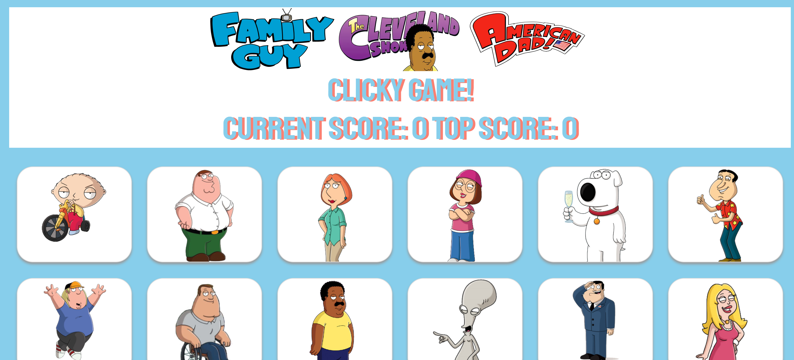

# Clicky Game

This is the Seth Macfarlane Clicky Memory Game! Goal is to reach the high score by clicking all the characters without repeating or
duplicating them. 

## Overview
The Clicky Game application was created using React.js. User clicks an image, array of characters shuffles and score goes up. User clicks the same picture, array of characters shuffles and score resets.

## Technologies:
* React.js

Play the game here: https://whispering-meadow-21898.herokuapp.com/

